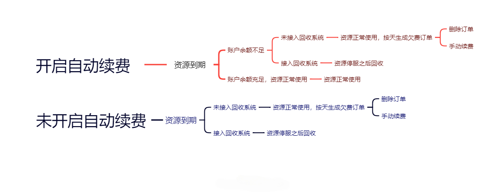
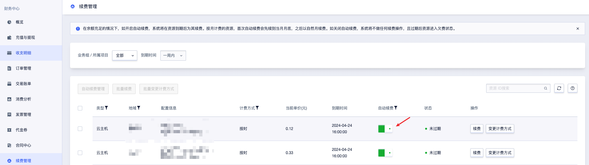
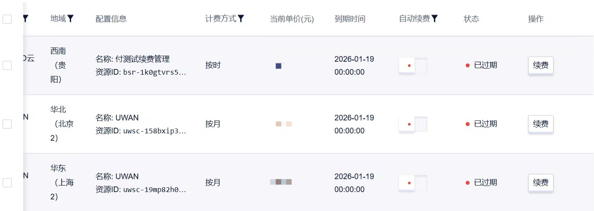

# 预付费资源

## 新购
您首次购买新产品，会生成一张新购订单。

## 配置升级和降级
在预付费模式下，当您购买的产品规格配置无法满足业务需求时，优刻得支持您对产品进行配置变更操作。

### 升配介绍说明
升配指用户对目前所使用的资源进行配置升级。

 **升配计费规则说明**
1. **公式**：  
   升配费用 = 新配置剩余时长费用 - 原配置剩余时长费用

   新配置剩余时长费用 = 新配置价值 × (剩余时间 ÷ 原服务时长)

   原配置剩余时长费用 = 原配置价值 × (剩余时间 ÷ 原服务时间)

 **配置升级后产品到期时间不变，以剩余服务周期计算补款。升配通常情况下需要补缴相应金额的费用支付升配变更订单。**

2. **计算示例**：  
   (此处以UHost为例)  
   您购买指定配置UHost 30天，价值120元，使用10天后需升级为新配置UHost，价值240元。  
   升配应付金额 = 240元 × (20天 ÷ 30天) - 120元 × (20天 ÷ 30天) = 80元

 **升配订单支付规则说明**
 
升配费用是根据升配订单下单时间计算的。

### 降配介绍说明

降配指用户对目前所使用的资源进行配置降级。

**降配计费规则说明**

1. **公式**：  
   降配退款金额 = 原配置剩余时长费用 - 新配置剩余时长费用  

   原配置剩余时长费用 = 原配置价值 × (剩余时间 ÷ 原服务时间)  
   新配置剩余时长费用 = 新配置价值 × (剩余时间 ÷ 原服务时间)  

 **配置降级后产品到期时间不变，以剩余服务周期计算退款。降配通常情况下会将剩余金额退还到您账户里面。**

2. **计算示例**：  
   (此处以UHost为例)  
   您购买指定配置UHost 30天，价值240元，使用10天后需降级为新配置UHost，价值120元。  

   降配退款金额 = 升配应付金额 = 240元 × (20天 ÷ 30天) - 120元 × (20天 ÷ 30天) = 80元  

**降配订单支付规则说明**

降配退款是根据降配订单的下单时间计算的。

## 删除资源退费

1. 在预付费模式下，如果您删除资源并且资源未到期，系统会退还您未被消费的金额。预付费资源在购买时已享受周期购买优惠，如果使用不满一个周期，将在退费时扣除优惠。
2. 在预付费模式下，如果您删除已过期的资源，系统会自动撤销资源过期开始点——主动删除点期间的过期订单，并产生一条金额为0的删除订单（已完成订单）。

---

### 未过期资源退费规则说明

**退款金额 = 实付订单金额 - 已消费金额**

 **1. 按日购买的资源**

**公式：**

- 使用时长等于购买周期：已消费金额 = 实付订单金额  
- 使用时长小于购买周期：已消费金额 = 实付订单金额 ×（已使用时长 ÷ 购买周期总时长） × 1.25  

---

1. **退费时最小计算单位为小时，不满一小时按一小时计算。**  
2. **退款金额中，购买时使用的代金券部分不支持退还，购买时使用的非代金券部分（现金/赠金）按支付比例退还。**  
3. **若已消费金额大于或等于实付订单金额，退款金额为零，欠款部分不作补收。**

---

**计算示例：**

您购买一天UHost，支付30元，使用12小时后，删除资源进行退费。

已消费金额：  
30元 ×（12小时 ÷ 24小时）× 1.25 = 18.75元

应退金额：  
30元 - 18.75元 = 11.25元

**2. 按月购买的资源**

**公式：**

- 使用时长等于购买周期：已消费金额 = 实付订单金额  
- 使用时长小于购买周期：已消费金额 = 实付订单金额 ×（已使用时长 ÷ 购买周期总时长） × 1.5  

---

1. **退费时最小计费单位为小时，不满一小时按一小时计算。**
2. **退款金额中，购买时使用的代金券部分不支持退还，购买时使用的非代金券部分（现金/赠金）按支付比例退还。**
3. **若已消费金额大于或等于实付订单金额，退款金额为零，欠款部分不作补收。**

---

**计算示例：**

您购买一天UHost，支付800元，使用10天后，删除资源进行退费。

已消费金额：  
800元 × (10天 ÷ 30天) × 1.5 = 400元  

应退金额：  
800元 - 400元 = 400元

**3. 按年购买的资源**

**公式：**

- 使用时长等于购买周期：已消费金额 = 实付订单金额  
- 使用时长小于购买周期：已消费金额 = 月单价 × 12 × 年数 ×（已使用时长 ÷ 购买周期总时长）

---

1. **退费时最小计费单位为小时，不满一小时按一小时计算。**
2. **退款金额中，购买时使用的代金券部分不支持退还，购买时使用的非代金券部分（现金/赠金）按支付比例退还。**  
3. **若已消费金额大于或等于实付订单金额，退款金额为零，欠款部分不作补收。**

---

**计算示例：**

您购买一年UHost，支付8000元（月单价800元），使用11个月后，删除资源进行退费。  

已消费金额：  
800元 × 12 × 1 × (11 ÷ 12) = 8800元  

应退金额：  
8000元 - 8800元 = -800元  

【退款金额为0元，多出费用不额外收取】

**特别说明**

1. 以套餐包或一次性批量形式购买的UCDN、UFile、高防、短信包等产品不进行退费。  
2. 按日购买云主机，并提前释放，不作退费。  
3. 购买轻量云主机退费规则：不足一天按天计算使用周期，使用部分按天1.5倍赔付，详见 [轻量云主机退费细则](https://docs.ucloud.cn/ulhost/introduction/charge)。  
4. 购买时使用的代金券一律不支持退还。  
5. 参与促销的产品，退费金额请参考具体活动规则。

## 续费、欠费、资源过期回收

1. 当您的资源已开启自动续费，在资源到期时，系统将根据账户余额情况执行不同处理：

**账户余额充足**
系统将自动完成续费，资源可正常使用，服务不中断。

**账户余额不足**
系统将根据资源是否接入回收系统，触发以下两种机制：
 - **未接入回收系统**：资源可继续正常使用，系统将按天生成欠费订单。您可选择删除订单（系统将撤销欠费订单并生成金额为0的已完成订单）或手动续费。
 - **已接入回收系统**：资源将进入停服期，若逾期未补缴欠款，资源将被回收。

2. 当您的资源未开启自动续费，在资源到期时，系统将根据资源是否接入回收系统执行不同处理：
  - **未接入回收系统**：资源可继续正常使用，系统将按天生成欠费订单。您可选择删除订单（系统将撤销欠费订单并生成金额为0的已完成订单）或手动续费。
  - **已接入回收系统**：资源将进入停服期，若逾期未补缴欠款，资源将被回收。

### 续费

优刻得支持两种续费模式，适用于预付费资源。

- **自动续费**：系统在资源到期时扣款续费，需提前开通并确保账户余额充足。
- **手动续费**：用户在资源到期前或到期后规定时间内手动操作续费。

**自动续费规则和操作**

**续费规则**

1. 年付、月付资源（除高防产品外）会在过期后的24小时内执行自动续费，如续费失败会进入回收。
2. 按时资（除高防产品外）会在过期后的1小时内执行自动续费，如续费失败会进入回收。

**续费周期规则**

月付的预付费资源（除高防产品外）在金额充足的情况下，首次自动续费会先自动续费到月底，之后再以自然月续费。

- **例**：某个按月付费的网络资源即将到期，在2025-5-15 17:58首次自动续费，系统会自动续费到2025-06-01 00:00:00，下一个续费周期是2025-06-01 00:00:00-2025-07-01 00:00:00。

按时的预付费资源（除高防产品外）在金额充足的情况下，首次自动续费会先对剩余额度，之后再以整数续费。（为避免系统因误造成业务影响，按时的未开启自动续费的资源在手动续费后会默认开启自动续费。）

- **例**：某个按月付费的网络资源即将到期，在17:30首次自动续费，系统会自动续费到18:00:00，下一个续费周期是18:00:00-19:00:00。

---

1. 若续费时账户可用余额不足，自动续费操作顺延至第二天，直到完成续费。
2. 若在资源过期时仍未完成续费，每日生成过期欠费订单，充值后系统自动延续上一周期续费，并撤销所有欠费订单，生成一张续费订单。

---
**续费操作**

**开通自动续费操作**

当您购买产品后，可登录控制台在 **财务中心 > 续费管理** 中查看该资源的“自动续费开关”。

开启“自动续费开关”，当您的账户余额充足时，系统会在即将到期时，自动为您续费（自动续费是按之前的配置和时长为您自动续费）。当账户余额不足时，若产品接入了回收系统，该资源会进入回收阶段；若产品未接入回收系统，系统会生成过期订单，您需要手动完成续费。

**关闭自动续费操作**

关闭“自动续费开关”，到期后资源进入欠费状态，系统会提示您资源到期和续费事宜，此时系统不会释放用户的资源，用户可以通过手动续费来进行续费，在续费时可重新选择续费周期。如果用户不进行充值并手动续费，则扣费失败，资源状态显示“已过期”。

**手动续费规则和操作**

**触发场景**
1. 自动续费开关已关闭；
2. 自动续费因账户余额不足失败；
3. 资源已过期且未完成自动续费。

**续费规则**
1. 续费时可重新选择续费周期（区别于自动续费的“按原配置续费”）；
2. 需先处理资源关联的欠费订单，方可完成续费。

**手动续费操作**
当您购买产品后，可登录控制台在 **财务中心 > 续费管理** 中查看该资源的续费操作，点击“续费”，自主选择续费周期。

### 欠费

若您购买的预付费资源过期后未及时续费，该资源将进入欠费状态，具体欠费金额将根据资源的处理场景差异对应计算。

**预付费资源的欠费场景分为以下 2 类：**

1. **资源已过期并删除**：若预付费资源过期后，您已将该资源删除，系统会撤销过期（欠费）订单并生成一条金额为0的删除订单（已完成订单），不会产生任何欠费金额。
2. **资源已过期未删除**：预付费资源的使用周期结束（即资源过期）后，若您未删除该资源，且资源仍处于使用状态，系统会生成一条过期（欠费）订单，过期订单不会马上生成，按天生成，在每日凌晨一点生成当天的欠费订单。欠费金额从资源过期之日起计算，根据实际持续使用时长和对应计费规则计算。

### 资源过期回收

预付费资源到期后未成功续费并接入回收系统，资源将进入停服期，资源使用将会受限。超出停服期后，资源将被强制回收，资源一经回收将无法恢复。请在规定时间内（资源强制回收前）及时续费，以免无法正常使用相应资源。

用户可为资源设置自动续费（购买资源时自动续费已默认勾选）。设置成功后，资源到期时，系统会自动扣除用户账户余额进行续费。

---

如果您购买的资源未接入回收系统，则会一直按天产生过期欠费订单。

---

**资源到期处理规则**

**自动续费说明**
若您已为资源开启自动续费功能，且账户余额充足，在资源未进入回收阶段的情况下，系统将自动完成该资源的续费操作，同时不会推送该资源的到期、停服、回收相关提醒。

**非自动续费说明**
若您未为资源开启自动续费功能，或账户余额不足以完成续费，资源将进入到到期流程：

**资源到期影响**
1. 到期阶段：资源处于过期状态，暂无影响。
2. 停服阶段：资源处于关机状态，用户仅可进行续费操作，无法开展其他任何操作。
3. 回收阶段：资源已被释放，其数据被清理且不可恢复，重新开通后才能正常使用。

**到期相关提醒**
1. 到期前提醒：系统将在资源到期的第7天、3天和1天推送资源即将到期警告（对于按月和非按月计费资源），通知以邮件、短信和站内信的方式推送（实际接收方式以用户在回收告警的配置为准）。
2. 停服提醒：资源到期后，系统会在停服24小时前发送资源即将停服警告，通知用户资源即将被停服，如需继续使用需尽快续费。
3. 停服提醒：按月半年计费资源将在到期后3天停服并发送停服通知；按时计费资源将在到期24小时后10:00-12:00间停服并发送停服通知，其中，不足72小时的资源将在到期1小时后停服。
4. 回收提醒：系统会在资源回收的24小时内会推送资源即将回收告警，通知用户资源即将被回收，如需继续使用需尽快续费。
5. 回收提醒：按月半年计费资源将在到期后10天回收，UDB产品为14天；按时计费资源将在到期24小时后15:00-18:00间回收（UDisk按时计费资源仍为10天回收，UDB按时计费资源仍为14天回收）。

---

系统会在资源到期、停服、回收后会通过邮件、短信和站内信方式进行提醒（实际接收方式以用户在回收告警的配置为准）。

---
