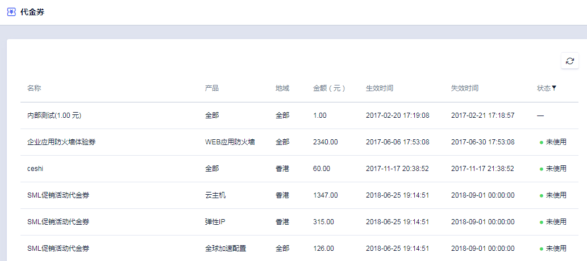
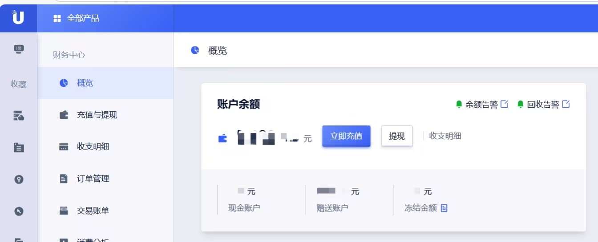

# 代金券和赠金

## 代金券

代金券是可抵扣费用的优惠券，您可以在 **用户中心 > 账户管理 > 代金券** 页面中查看账户下的代金券情况。

### 代金券使用规则

**使用场景**

代金券适用于新购和手动续费订单，但不适用于自动续费订单和后付费订单。

**金额和有效期**

代金券有金额和有效期，在代金券页面中可以查看具体金额大小和生效、失效时间。

**使用次数**

代金券每次仅可使用一张。

**金额处理规则**

| 处理方式             | 对应场景说明                                                                                             |
|----------------------|----------------------------------------------------------------------------------------------------------|
| 退还代金券           | 使用代金券购买资源时，如果遇到支付失败或发货失败的情况，代金券将全额退还。                               |
| 不退还代金券         | 1. 使用代金券支付成功，不支持退还。 2. 用户资源被删除后，使用代金券抵扣的金额不支持退还。 3. 一张代金券仅可用于抵扣一个资源单次购买或续费时的费用，若订单实际费用低于代金券面额，该代金券未使用的剩余金额不支持退还。 |

## 赠金

赠金是优刻得提供的不可提现资金，用于支付资源费用，通常由销售赠与，您可以登录控制台在概览中看到赠送账户情况。

### 赠金使用规则

**使用场景**

赠金适用于赠金发放之后的订单使用，不支持发放之前的欠费订单使用。

赠金不支持已生成的欠费订单。
